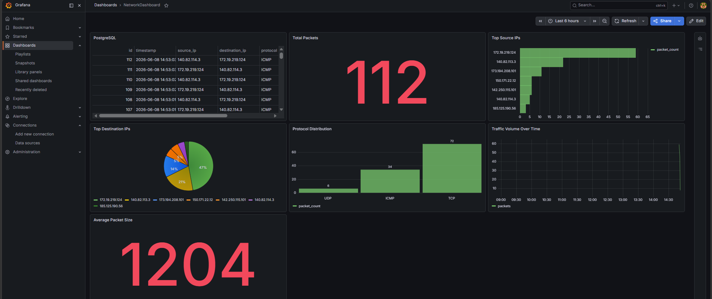
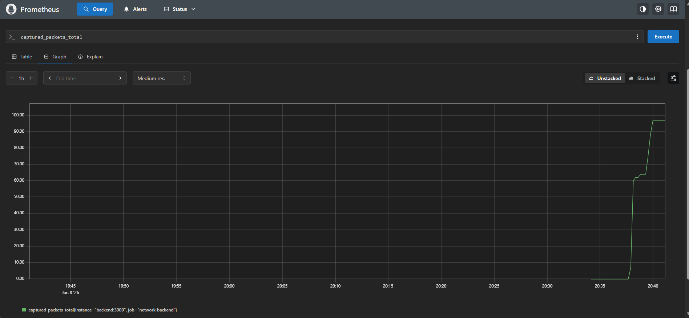
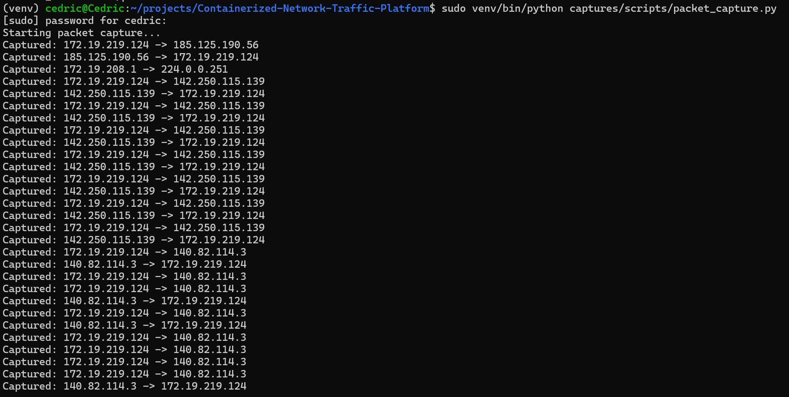
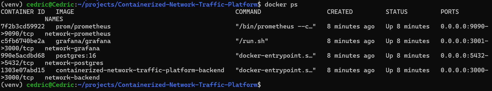

# Containerized Network Traffic Platform

## Overview

The Containerized Network Traffic Platform is a full-stack network monitoring solution designed to capture, store, analyze, and visualize network traffic in real time. The platform combines packet capture, containerized services, database storage, metrics collection, and dashboard visualization into a single deployable environment.

The project demonstrates practical skills in networking, backend development, observability, Linux administration, containerization, and cloud-native monitoring technologies.

---

## Key Features

* Real-time packet capture using Python and Scapy
* REST API built with Node.js and Express
* PostgreSQL database for packet storage and analysis
* Grafana dashboards for traffic visualization
* Prometheus metrics collection and monitoring
* Dockerized multi-container deployment
* Network traffic persistence and historical analysis
* API endpoints for packet retrieval and monitoring

---

## Architecture

```text
Internet Traffic
       │
       ▼
Scapy Packet Capture
       │
       ▼
Node.js REST API
       │
       ▼
PostgreSQL Database
       │
       ├────────► Prometheus Metrics
       │               │
       │               ▼
       │          Alert Rules
       │
       ▼
Grafana Dashboards
```

---

## Technology Stack

### Backend

* Node.js
* Express.js

### Database

* PostgreSQL

### Monitoring & Observability

* Grafana
* Prometheus
* Prometheus Client Library

### Networking

* Python
* Scapy

### Containerization

* Docker
* Docker Compose

### Operating System

* Ubuntu Linux (WSL2)

---

## Screenshots

### Grafana Dashboard

Visualizes captured network traffic stored in PostgreSQL.



---

### Prometheus Metrics

Prometheus scraping application metrics from the backend service.



---

### Live Packet Capture

Scapy capturing and forwarding packet metadata to the backend API.



---

### Containerized Environment

Docker containers running the complete monitoring stack.



---

## API Endpoints

### Health Check

```http
GET /
```

Response:

```json
{
  "service": "Containerized Network Traffic Platform",
  "status": "running",
  "version": "0.1.0"
}
```

---

### Database Connectivity Test

```http
GET /db-test
```

---

### Retrieve Captured Packets

```http
GET /packets
```

---

### Store Packet Data

```http
POST /packets
```

Example Request:

```json
{
  "source_ip": "192.168.1.10",
  "destination_ip": "8.8.8.8",
  "protocol": "TCP",
  "packet_length": 1500
}
```

---

### Prometheus Metrics

```http
GET /metrics
```

Provides Prometheus-compatible metrics including:

* Process metrics
* Node.js metrics
* Packet capture counters

---

## Running the Project

Clone the repository:

```bash
git clone https://github.com/C3dricJ/Containerized-Network-Traffic-Platform.git
cd Containerized-Network-Traffic-Platform
```

Start all services:

```bash
docker compose up -d --build
```

Verify the backend:

```bash
curl http://localhost:3000
```

Access services:

| Service     | URL                   |
| ----------- | --------------------- |
| Backend API | http://localhost:3000 |
| Grafana     | http://localhost:3001 |
| Prometheus  | http://localhost:9090 |

---

## Skills Demonstrated

* Network Traffic Analysis
* Packet Inspection
* REST API Development
* Docker Containerization
* PostgreSQL Database Administration
* Linux System Administration
* Monitoring and Observability
* Prometheus Metrics Collection
* Grafana Dashboard Development
* Backend Development
* Infrastructure Automation
* Troubleshooting and Debugging

---
